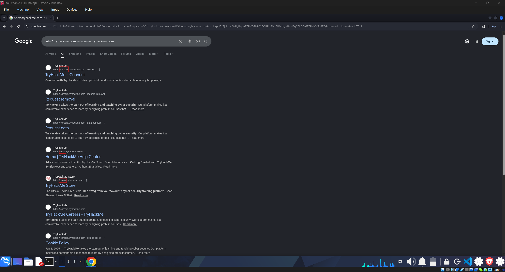
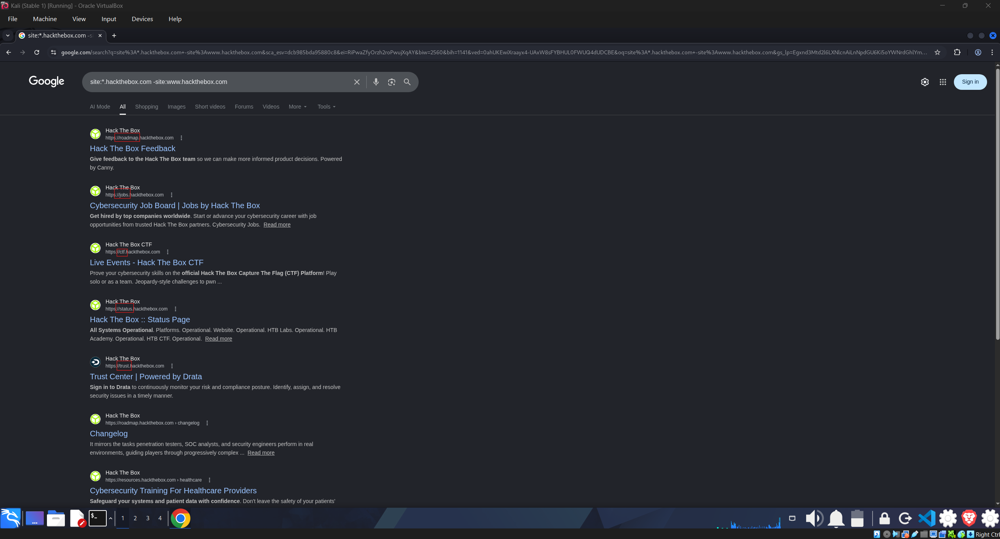
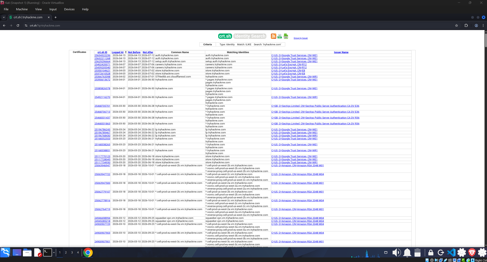
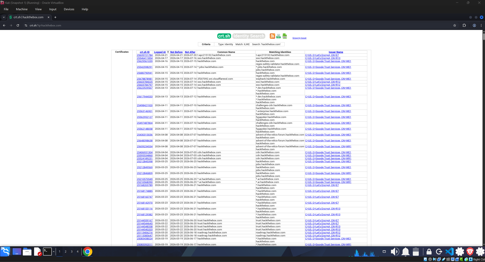
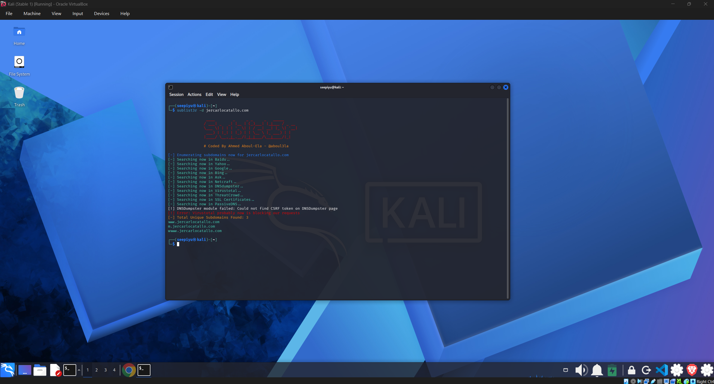
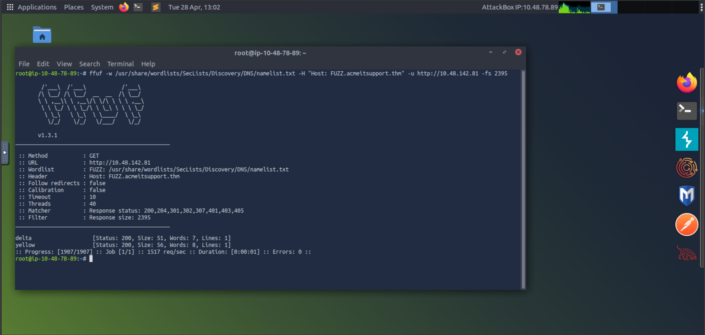
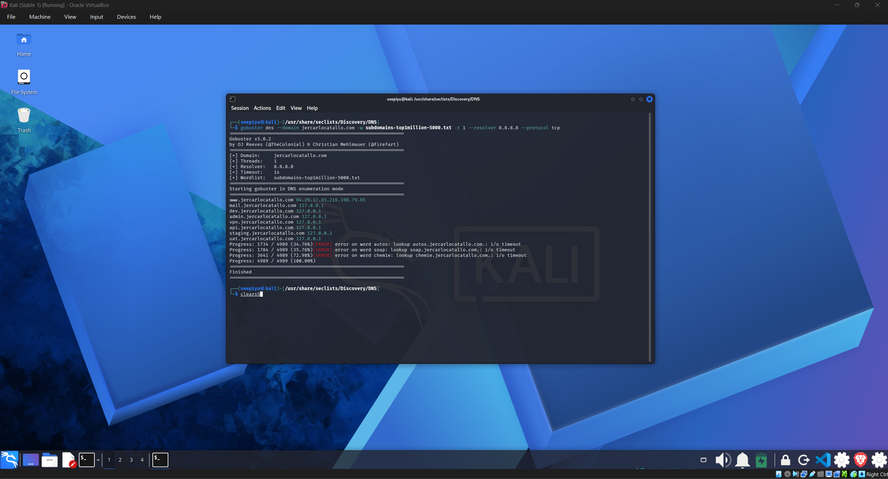

# Subdomain Enumeration Lab

## Table of Contents

- [Overview](#overview)
- [Lab Goals](#lab-goals)
- [Ethical Considerations](#ethical-considerations)
- [Demonstration](#demonstration)
  - [Search Engine OSINT for HackTheBox](#search-engine-osint-for-hackthebox)
  - [Search Engine OSINT for TryHackMe](#search-engine-osint-for-tryhackme)
  - [Certificate Transparency on tryhackme.com](#certificate-transparency-on-tryhackmecom)
  - [Certificate Transparency on hackthebox.com](#certificate-transparency-on-hacktheboxcom)
  - [Passive Enumeration with Sublist3r](#passive-enumeration-with-sublist3r)
  - [Virtual Host Discovery with ffuf](#virtual-host-discovery-with-ffuf)
  - [Active DNS Brute Force with Gobuster](#active-dns-brute-force-with-gobuster)
- [Key Findings](#key-findings)
- [Summary](#summary)

## Overview

This lab covers passive and active subdomain enumeration techniques. I compare what each method shows about the external attack surface.

## Lab Goals

- Find subdomains from public data sources like search engines and certificate logs.
- Check how certificate data can show extra infrastructure using crt.sh.
- Compare passive enumeration with Sublist3r and active DNS brute forcing with Gobuster.
- Run virtual host fuzzing with ffuf to find hostnames not visible in DNS records.

## Ethical Considerations

Subdomain enumeration is a reconnaissance activity. It has legal and operational impact. I follow these rules in every engagement:

- Authorization is mandatory.
Active DNS brute forcing or host-header fuzzing without written permission can break laws such as CFAA and local statutes.

- Passive does not always mean harmless.
Passive OSINT can still show sensitive information. I handle it with care.

- Rate limiting matters.
I use low thread counts (for example, -t 1) and wait between requests to avoid service disruption.

- Scope validation is required.
A discovered host is not automatically in scope. I check every asset against the approved scope list.

- Responsible disclosure applies.
I report unintended exposed infrastructure through proper authorized channels.

All activity in this lab ran against:
- Personal domain (jercarlocatallo.com), owned by me.
- TryHackMe lab environments, authorized training infrastructure.

## Demonstration

### Search Engine OSINT for HackTheBox

I ran a search query to find indexed subdomains for HackTheBox. This is a passive method with no direct contact to the target.

Command:
```text
site:*.hackthebox.com -site:www.hackthebox.com
```

Image/output artifact:


The screenshot shows search results that list subdomains indexed by Google.

Result and analysis:
- Publicly indexed subdomains include roadmap, jobs, ctf, status, and trust.
- This gives fast initial asset mapping with low interaction risk.

### Search Engine OSINT for TryHackMe

I applied the same search query pattern to TryHackMe to check indexed subdomains.

Command:
```text
site:*.tryhackme.com -site:www.tryhackme.com
```

Image/output artifact:


The screenshot shows search results that list subdomains indexed by Google for TryHackMe.

Result and analysis:
- Indexed results include subdomains such as careers, help, and store.
- This confirms indexing-based visibility and helps me prioritize deeper checks.

### Certificate Transparency on tryhackme.com

I checked certificate issuance history for tryhackme.com using crt.sh. This is a passive method that reads public certificate logs.

Command:
```text
crt.sh lookup for tryhackme.com
```

Image/output artifact:


The screenshot shows certificate entries from crt.sh that list hostnames issued for tryhackme.com.

Result and analysis:
- Certificate entries show wildcard and service-specific names.
- CT logs can include historical names not currently indexed by search engines.

### Certificate Transparency on hackthebox.com

I cross-checked certificate coverage for hackthebox.com against search-derived results.

Command:
```text
crt.sh lookup for hackthebox.com
```

Image/output artifact:


The screenshot shows certificate entries from crt.sh that list hostnames issued for hackthebox.com.

Result and analysis:
- Additional hostnames appear from issued certificates.
- This increases my confidence in asset coverage before active validation.

### Passive Enumeration with Sublist3r

I ran Sublist3r to collect passive data from multiple external sources for my personal domain.

Command:
```bash
sublist3r -d jercarlocatallo.com
```

Image/output artifact:


The screenshot shows Sublist3r output with discovered subdomains and source information.

Result and analysis:
- 3 unique subdomains were discovered:
  - www.jercarlocatallo.com
  - m.jercarlocatallo.com
  - jercarlocatallo.com
- One source (VirusTotal) blocked requests during collection, but output was still returned.
- Passive output quality depends on source availability and rate limits.

### Virtual Host Discovery with ffuf

I used ffuf for active host-header fuzzing to find hostnames behind a target IP in a TryHackMe lab environment.

Command:
```bash
ffuf -w /usr/share/wordlists/SecLists/Discovery/DNS/namelist.txt \
  -H "Host: FUZZ.acmeitsupport.thm" \
  -u http://10.48.142.81 \
  -fs 2395
```

Image/output artifact:


The screenshot shows ffuf output with two discovered virtual hosts and their response sizes.

Result and analysis:
- Two virtual hosts were found: delta and yellow.
- This confirms HTTP-layer discovery can expose hosts not visible in public OSINT datasets.

### Active DNS Brute Force with Gobuster

I ran Gobuster for direct DNS brute forcing to find subdomains not captured by passive sources.

Command:
```bash
gobuster dns \
  -d jercarlocatallo.com \
  -w subdomains-top1million-5000.txt \
  -t 1 \
  --resolver 8.8.8.8 \
  --protocol tcp
```

Command explanation:
Standard DNS typically uses UDP, which can drop packets under load. TCP reduces timeout noise and improves consistency for wordlist-based enumeration.

Image/output artifact:


The screenshot shows Gobuster output with resolved subdomains and their IP addresses.

Result and analysis:
- 8 subdomains resolved:

| Subdomain | IP Resolved |
|---|---|
| www.jercarlocatallo.com | 64.29.17.X (public IP) |
| mail.jercarlocatallo.com | 127.0.0.1 |
| dev.jercarlocatallo.com | 127.0.0.1 |
| admin.jercarlocatallo.com | 127.0.0.1 |
| vpn.jercarlocatallo.com | 127.0.0.1 |
| api.jercarlocatallo.com | 127.0.0.1 |
| staging.jercarlocatallo.com | 127.0.0.1 |
| uat.jercarlocatallo.com | 127.0.0.1 |

- Some words (autos, soap, chemie) produced i/o timeouts, which is expected resolver noise.
- The scan completed over 4,989 words.
- Loopback results indicate locally configured DNS entries that may map to non-public infrastructure.

## Key Findings

- No single method is complete by itself.
- Search engines are fast but limited to indexed assets.
- crt.sh provides deeper hostname visibility through certificate history.
- Sublist3r found 3 publicly known subdomains.
- Gobuster found 8 subdomains, including infrastructure names not visible in passive results.
- Using --protocol tcp with -t 1 improved reliability and reduced miss risk.
- ffuf identified HTTP virtual hosts that may not appear in DNS records.

Key observation:
Sublist3r discovered m.jercarlocatallo.com from third-party data, but it missed infrastructure subdomains (dev, admin, vpn, api, staging, uat, mail) that Gobuster found through direct DNS resolution.

## Summary

This lab confirms the core principle of external reconnaissance. Passive techniques show what public data sources know. Active techniques show what DNS and application behavior expose. I combine both approaches to improve attack surface visibility and reduce blind spots.
